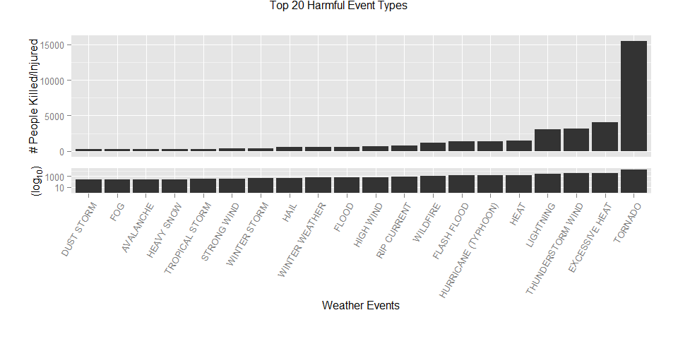
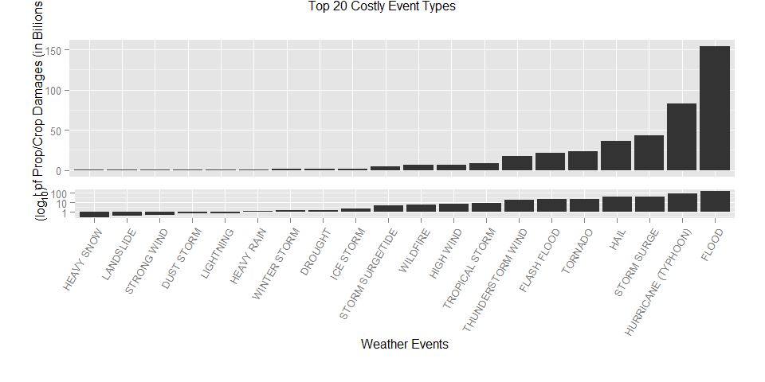
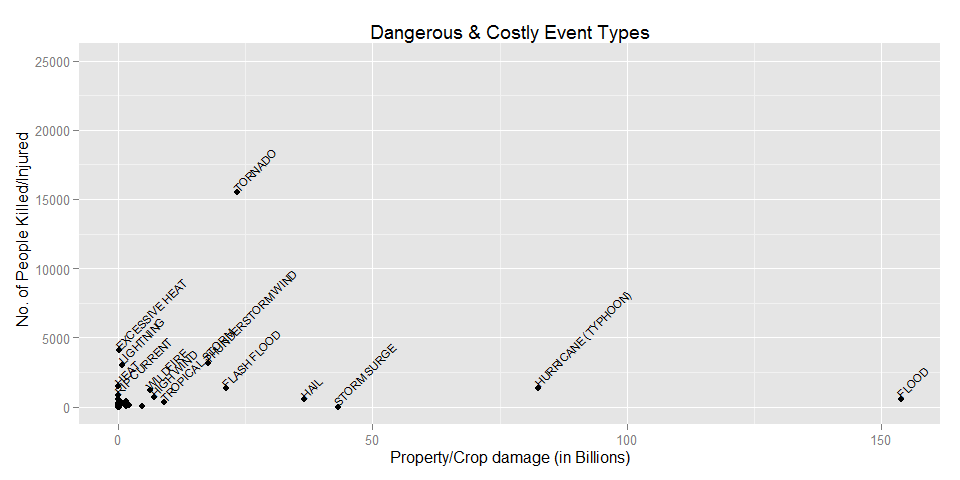

# Reproducible Research: Peer Assessment 2
Mark Ching  
##Synopsis
This report we aim to provide some insights about severe weather events for a government or municipal manager who might be responsible for preparing for severe weather events whom will need to prioritize resources for different types of events. Specifically, this reports will try to identify which types of events are the most harmful to population health and the most costly to the economy. Recommendations are provided at the end of the report.

## Data Processing
### Loading necessary libraries and set options

```r
library(knitr)
library(data.table)
library(xtable)
library(ggplot2)
library(R.utils)
```

```
## Loading required package: R.oo
## Loading required package: R.methodsS3
## R.methodsS3 v1.6.1 (2014-01-04) successfully loaded. See ?R.methodsS3 for help.
## R.oo v1.18.0 (2014-02-22) successfully loaded. See ?R.oo for help.
## 
## Attaching package: 'R.oo'
## 
## The following objects are masked from 'package:methods':
## 
##     getClasses, getMethods
## 
## The following objects are masked from 'package:base':
## 
##     attach, detach, gc, load, save
## 
## R.utils v1.34.0 (2014-10-07) successfully loaded. See ?R.utils for help.
## 
## Attaching package: 'R.utils'
## 
## The following object is masked from 'package:utils':
## 
##     timestamp
## 
## The following objects are masked from 'package:base':
## 
##     cat, commandArgs, getOption, inherits, isOpen, parse, warnings
```

```r
library(gridExtra)
```

```
## Loading required package: grid
```

```r
library(dplyr)
```

```
## 
## Attaching package: 'dplyr'
## 
## The following objects are masked from 'package:data.table':
## 
##     between, last
## 
## The following object is masked from 'package:stats':
## 
##     filter
## 
## The following objects are masked from 'package:base':
## 
##     intersect, setdiff, setequal, union
```

```r
library(quantmod)
```

```
## Loading required package: xts
## Loading required package: zoo
## 
## Attaching package: 'zoo'
## 
## The following objects are masked from 'package:base':
## 
##     as.Date, as.Date.numeric
## 
## 
## Attaching package: 'xts'
## 
## The following objects are masked from 'package:dplyr':
## 
##     first, last
## 
## The following object is masked from 'package:data.table':
## 
##     last
## 
## Loading required package: TTR
## Version 0.4-0 included new data defaults. See ?getSymbols.
```

```r
opts_chunk$set(echo = TRUE, results = 'hold')
options(digits = 7)
opts_chunk$set(fig.width=10)
```


### Download , Load  and preprocessing the data

1. Download the file

```r
#download.file("http://d396qusza40orc.cloudfront.net/repdata%2Fdata%2FStormData.csv.bz2", destfile="repdata-data-StormData.csv.bz2")
```
2. Unzip and read the data

```r
#bunzip2("repdata-data-StormData.csv.bz2", overwrite=T, remove=F)
stormactivity <- read.csv("repdata-data-StormData.csv",sep=",",quote="\"",
                         header=TRUE,  na.strings="NA")
```
3. Preprocess the data , clean and convert to the proper format

```r
#Filtering down to the data that has value more than 0
     filterStormData <-subset(stormactivity, FATALITIES >0 | INJURIES >0 | PROPDMG > 0 | CROPDMG > 0) 

#The events in the database start in the year 1950 and end in November 2011. In the earlier years of the database there are generally fewer events recorded, most likely due to a lack of good records. More recent years should be considered more complete. We that , we only analysis data from the last 10 years withhas a more complete set of data.

    filterStormData$year <- as.numeric(format(as.Date(filterStormData$BGN_DATE, format="%m/%d/%Y %H:%M:%S"), "%Y"))

    filterStormData <- filterStormData[filterStormData$year >=2001,]


#Convert event type to upper case 
    filterStormData[,c("EVTYPE")] <- toupper(filterStormData[,c("EVTYPE")])

#Combine and Standardize the events to a main event type
    filterStormData[filterStormData$EVTYPE=="AVALANCE",c("EVTYPE")] <- "AVALANCHE"

    filterStormData[grep("BLIZZARD*",filterStormData$EVTYPE),c("EVTYPE")] <- "BLIZZARD"

    filterStormData[grep("HAIL*",filterStormData$EVTYPE),c("EVTYPE")] <- "HAIL"

    filterStormData[grep("HEAVY RAIN*",filterStormData$EVTYPE),c("EVTYPE")] <- "HEAVY RAIN"

    filterStormData[grep("WATERSPOUT*",filterStormData$EVTYPE),c("EVTYPE")] <-"WATERSPOUT"

    filterStormData[grep("HURRICANE*",filterStormData$EVTYPE),c("EVTYPE")] <-"HURRICANE"

    filterStormData[grep("THUNDERSTORM*|TUNDERSTORM WIND*|TSTM WIND*|THUDERSTORM WINDS*",filterStormData$EVTYPE),c("EVTYPE")] <-"THUNDERSTORM WIND"

    filterStormData[grep("THUNDEERSTORM WINDS*",filterStormData$EVTYPE),c("EVTYPE")] <-"THUNDERSTORM WIND"

    filterStormData[grep("THUNDERESTORM WINDS*",filterStormData$EVTYPE),c("EVTYPE")] <-"THUNDERSTORM WIND"

    filterStormData[grep("THUNDERTORM WINDS*",filterStormData$EVTYPE),c("EVTYPE")] <-"THUNDERSTORM WIND"

    filterStormData[grep("THUNERSTORM WINDS*",filterStormData$EVTYPE),c("EVTYPE")] <-"THUNDERSTORM WIND"

    filterStormData[grep("THUNDERSTROM WIND*",filterStormData$EVTYPE),c("EVTYPE")] <-"THUNDERSTORM WIND"

    filterStormData[grep("THUNDERSTROM WIND*",filterStormData$EVTYPE),c("EVTYPE")] <-"THUNDERSTORM WIND"

    filterStormData[grep("TSTMW*",filterStormData$EVTYPE),c("EVTYPE")] <-"THUNDERSTORM WIND"

    filterStormData[grep("TORNADO*",filterStormData$EVTYPE),c("EVTYPE")] <-"TORNADO"

    filterStormData[grep("TORNDAO*",filterStormData$EVTYPE),c("EVTYPE")] <-"TORNADO"

    filterStormData[grep("RIP CURRENT*",filterStormData$EVTYPE),c("EVTYPE")] <-"RIP CURRENT"

    filterStormData[grep("STRONG WIND*",filterStormData$EVTYPE),c("EVTYPE")] <-"STRONG WIND"

    filterStormData[grep("LIGHTNING*",filterStormData$EVTYPE),c("EVTYPE")] <-"LIGHTNING"

    filterStormData[grep("LIGHTING*|LIGNTNING*",filterStormData$EVTYPE),c("EVTYPE")] <-"LIGHTNING"       

    filterStormData[grep("FLASH FLOOD*",filterStormData$EVTYPE),c("EVTYPE")] <-"FLASH FLOOD" 

    filterStormData[grep("WINTER WEATHER*",filterStormData$EVTYPE),c("EVTYPE")] <-"WINTER WEATHER"

    filterStormData[grep("WINTER STORM*",filterStormData$EVTYPE),c("EVTYPE")] <-"WINTER STORM"

    filterStormData[grep("TROPICAL STORM*",filterStormData$EVTYPE),c("EVTYPE")] <-"TROPICAL STORM"

    filterStormData[grep("HEAVY SNOW*",filterStormData$EVTYPE),c("EVTYPE")] <-"HEAVY SNOW"

    filterStormData[grep("HEAVY RAIN*|HVY RAIN*",filterStormData$EVTYPE),c("EVTYPE")] <-"HEAVY RAIN"

    filterStormData[grep("FLOOD/FLASH*|FLOOD FLASH*",filterStormData$EVTYPE),c("EVTYPE")] <-"FLASH FLOOD"

    filterStormData[grep("FLOODING|FLOOD/RIVER FLOOD|FLOODS|FLOOD/RAIN/WINDS",filterStormData$EVTYPE),c("EVTYPE")] <-"FLOOD"

    filterStormData[grep("WILDFIRES*|WILD FIRES*|WILDFIRE*|WILD/FOREST*",filterStormData$EVTYPE),c("EVTYPE")] <-"WILDFIRE"

    filterStormData[grep("HURRICANE*|TYPHOON*",filterStormData$EVTYPE),c("EVTYPE")] <-"HURRICANE (TYPHOON)"   

#Convert the Property and Crop Damage to the correct units as per in the codebook (National Climatic Data Center's record layout document, which is referenced on the Investigative Reporers & Editors web site.)

    filterStormData$PROPDMGEXP = as.character(filterStormData$PROPDMGEXP)
    filterStormData$PROPDMGEXP[toupper(filterStormData$PROPDMGEXP) == 'B'] = "9"
    filterStormData$PROPDMGEXP[toupper(filterStormData$PROPDMGEXP) == 'M'] = "6"
    filterStormData$PROPDMGEXP[toupper(filterStormData$PROPDMGEXP) == 'K'] = "3"
    filterStormData$PROPDMGEXP[toupper(filterStormData$PROPDMGEXP) == 'H'] = "2"
    filterStormData$PROPDMGEXP = as.numeric(filterStormData$PROPDMGEXP)
    filterStormData$PROPDMGEXP[is.na(filterStormData$PROPDMGEXP)] = 0
    filterStormData$PropertyDamage = filterStormData$PROPDMG * 10^filterStormData$PROPDMGEXP

    filterStormData$CROPDMGEXP = as.character(filterStormData$CROPDMGEXP)
    filterStormData$CROPDMGEXP[toupper(filterStormData$CROPDMGEXP) == 'B'] = "9"
    filterStormData$CROPDMGEXP[toupper(filterStormData$CROPDMGEXP) == 'M'] = "6"
    filterStormData$CROPDMGEXP[toupper(filterStormData$CROPDMGEXP) == 'K'] = "3"
    filterStormData$CROPDMGEXP[toupper(filterStormData$CROPDMGEXP) == 'H'] = "2"
    filterStormData$CROPDMGEXP = as.numeric(filterStormData$CROPDMGEXP)
    filterStormData$CROPDMGEXP[is.na(filterStormData$CROPDMGEXP)] = 0
    filterStormData$CropDamage = filterStormData$PROPDMG * 10^filterStormData$CROPDMGEXP
```
4. Preview the data read

```r
        head(filterStormData,n=10)
```

```
##        STATE__          BGN_DATE    BGN_TIME TIME_ZONE COUNTY COUNTYNAME
## 413286       1 2/25/2001 0:00:00 01:00:00 AM       CST    133    WINSTON
## 413287       1 2/25/2001 0:00:00 01:15:00 AM       CST     91    MARENGO
## 413289       1 2/27/2001 0:00:00 04:45:00 PM       CST     99     MONROE
## 413290       1 2/27/2001 0:00:00 04:50:00 PM       CST     35    CONECUH
## 413291       1  3/2/2001 0:00:00 03:15:00 PM       CST     23    CHOCTAW
## 413292       1  3/2/2001 0:00:00 04:55:00 PM       CST     47     DALLAS
## 413293       1  3/2/2001 0:00:00 06:29:00 PM       CST    101 MONTGOMERY
## 413294       1  3/2/2001 0:00:00 09:18:00 PM       CST      5    BARBOUR
## 413295       1  3/3/2001 0:00:00 02:30:00 AM       CST     23    CHOCTAW
## 413296       1  7/5/2001 0:00:00 02:00:00 PM       CST    127     WALKER
##        STATE            EVTYPE BGN_RANGE BGN_AZI  BGN_LOCATI
## 413286    AL THUNDERSTORM WIND         0             ADDISON
## 413287    AL THUNDERSTORM WIND         0         SWEET WATER
## 413289    AL THUNDERSTORM WIND         7      NE    PETERMAN
## 413290    AL THUNDERSTORM WIND         0            NICHBURG
## 413291    AL THUNDERSTORM WIND         0               TOXEY
## 413292    AL THUNDERSTORM WIND         0          COUNTYWIDE
## 413293    AL           TORNADO         0          MONTGOMERY
## 413294    AL THUNDERSTORM WIND         0          LOUISVILLE
## 413295    AL       FLASH FLOOD         0          COUNTYWIDE
## 413296    AL       FLASH FLOOD         0             CORDOVA
##                 END_DATE    END_TIME COUNTY_END COUNTYENDN END_RANGE
## 413286 2/25/2001 0:00:00 01:00:00 AM          0         NA         0
## 413287 2/25/2001 0:00:00 01:20:00 AM          0         NA         0
## 413289 2/27/2001 0:00:00 04:50:00 PM          0         NA         7
## 413290 2/27/2001 0:00:00 04:55:00 PM          0         NA         0
## 413291  3/2/2001 0:00:00 03:20:00 PM          0         NA         0
## 413292  3/2/2001 0:00:00 05:25:00 PM          0         NA         0
## 413293  3/2/2001 0:00:00 06:33:00 PM          0         NA         0
## 413294  3/2/2001 0:00:00 09:18:00 PM          0         NA         0
## 413295  3/3/2001 0:00:00 06:30:00 PM          0         NA         0
## 413296  7/5/2001 0:00:00 03:00:00 PM          0         NA         0
##        END_AZI  END_LOCATI LENGTH WIDTH  F MAG FATALITIES INJURIES PROPDMG
## 413286             ADDISON    0.0     0 NA  50          0        0       2
## 413287         SWEET WATER    0.0     0 NA  75          0        0      15
## 413289      NE    PETERMAN    0.0     0 NA  55          0        0       5
## 413290            NICHBURG    0.0     0 NA  55          0        0       5
## 413291               TOXEY    0.0     0 NA  55          0        0       3
## 413292          COUNTYWIDE    0.0     0 NA  50          0        0       4
## 413293          MONTGOMERY    2.2   100  1   0          0        0     125
## 413294          LOUISVILLE    0.0     0 NA  50          0        0       6
## 413295          COUNTYWIDE    0.0     0 NA   0          0        0      10
## 413296             CORDOVA    0.0     0 NA   0          0        0       3
##        PROPDMGEXP CROPDMG CROPDMGEXP WFO         STATEOFFIC ZONENAMES
## 413286          3       0          3 BMX   ALABAMA, Central          
## 413287          3       0          0 MOB ALABAMA, Southwest          
## 413289          3       0          0 MOB ALABAMA, Southwest          
## 413290          3       0          0 MOB ALABAMA, Southwest          
## 413291          3       0          0 MOB ALABAMA, Southwest          
## 413292          3       0          3 BMX   ALABAMA, Central          
## 413293          3       0          3 BMX   ALABAMA, Central          
## 413294          3       0          3 BMX   ALABAMA, Central          
## 413295          3       0          0 MOB ALABAMA, Southwest          
## 413296          3       0          3 BMX   ALABAMA, Central          
##        LATITUDE LONGITUDE LATITUDE_E LONGITUDE_
## 413286     3412      8711       3412       8711
## 413287     3206      8752       3206       8752
## 413289     3139      8711       3139       8711
## 413290     3129      8708       3129       8708
## 413291     3154      8818       3154       8818
## 413292     3220      8708       3220       8708
## 413293     3223      8618       3223       8618
## 413294     3147      8534       3147       8534
## 413295        0         0          0          0
## 413296        0         0          0          0
##                                                                                                                                                                                                                                                                                                                                                                                                                                                                                                                                                                                                                                                                                                                                                                                                                                                                                                                                                                                                                                                                                                               REMARKS
## 413286                                                                                                                                                                                                                                                                                                                                                                                                                                                                                                                                                                                                                                                                                                                                                                                                                                                                                                                                                                                                                            A few trees were blown down in the northeast part of Winston County near Addison.\n
## 413287                                                                                                                                                                                                                                                                                                                                                                                                                                                                                                                                                                                                                                                                                                                                                                                                                                                                                                                                               Strong thunderstorm winds completely removed the roof  of a mobile home.  Trees that were blown down by the storm produced damage to two other nearby homes.  \n
## 413289                                                                                                                                                                                                                                                                                                                                                                                                                                                                                                                                                                                                                                                                                                                                                                                                                                                                                                                                                                                                        Thunderstorm winds blew down trees near Grey's Store, which is about 7 miles northeast of Peterman.  \n
## 413290                                                                                                                                                                                                                                                                                                                                                                                                                                                                                                                                                                                                                                                                                                                                                                                                                                                                                                                                                              Trees were blown down by strong thunderstorms north of the community.  Most of the downed trees were located between Pine Orchard and Ramah.   \n
## 413291                                                                                                                                                                                                                                                                                                                                                                                                                                                                                                                                                                                                                                                                                                                                                                                                                                                                                                                                                                                                                                      Wind damage reported in the community as a thunderstorm moved through. \n
## 413292                                                                                                                                                                                                                                                                                                                                                                                                                                                                                                                                                                                                                                                                                                                                                                                                                                                                                                                                                              Several trees were blown down across the entire county.  The Selma Police Department reported most of the trees were blown down in rural areas.\n
## 413293 The tornado began in the Woodmere area where a number of houses sustained roof damage primarily in the form of lost shingles, fences were downed, and small trees were uprooted. The tornado moved northeast and tracked through the Beauvoir Lake subdivision where one house under construction was flattened and another house was partially deroofed with serious damage to the upper level. \n\nFrom Beauvoir Lake subdivision the tornado downed trees and removed shingles from house roofs in the Halcyon area. The tornado crossed Interstate 85 just west of the Taylor Road exit snapping off numerous pine trees in the interstate median. The tornado apparently ended at Taylor Road on the north side of the interstate. \n\nThe tornado was rated at F1 based on structural damage in the Beauvoir Lake area. Much of the damage along the track was in the F0 category.  The tornado track was 2.2 miles in length and estimated to be about 100 yards wide at it's widest point. The tornado began at 6:29 PM and ended at 6:33 PM. No injuries or deaths were reported with this storm.\n\n
## 413294                                                                                                                                                                                                                                                                                                                                                                                                                                                                                                                                                                                                                                                                                                                                                                                                                                                                                                                                                                                                                                      Several trees were blown down and one barn was destroyed in Louisville.\n
## 413295                                                                                                                                                                                                                                                                                                                                                                                                                                                                                                                                                                                                                                                                                                                                                                                                                                                                                            Heavy rains across the counties caused many secondary roads to washout.  Several of the roads were closed throughout the day due to high water.  Radar estimated three to five inches of rain fell across the area.
## 413296                                                                                                                                                                                                                                                                                                                                                                                                                                                                                                                                                                                                                                                                                                                                                                                                                                                                                                                                                                                                          Several roads were covered with water and temporarily impassable in and around the city of Cordova.\n
##        REFNUM year PropertyDamage CropDamage
## 413286 413687 2001           2000       2000
## 413287 413688 2001          15000         15
## 413289 413690 2001           5000          5
## 413290 413691 2001           5000          5
## 413291 413692 2001           3000          3
## 413292 413693 2001           4000       4000
## 413293 413694 2001         125000     125000
## 413294 413695 2001           6000       6000
## 413295 413696 2001          10000         10
## 413296 414083 2001           3000       3000
```
5. Show data summary

```r
xt <- xtable(summary(stormactivity))
print(xt, type = "html")
```

<!-- html table generated in R 3.1.1 by xtable 1.7-4 package -->
<!-- Sun Oct 26 17:58:26 2014 -->
<table border=1>
<tr> <th>  </th> <th>    STATE__ </th> <th>              BGN_DATE </th> <th>        BGN_TIME </th> <th>   TIME_ZONE </th> <th>     COUNTY </th> <th>      COUNTYNAME </th> <th>     STATE </th> <th>               EVTYPE </th> <th>   BGN_RANGE </th> <th>    BGN_AZI </th> <th>         BGN_LOCATI </th> <th>              END_DATE </th> <th>        END_TIME </th> <th>   COUNTY_END </th> <th> COUNTYENDN </th> <th>   END_RANGE </th> <th>    END_AZI </th> <th>           END_LOCATI </th> <th>     LENGTH </th> <th>     WIDTH </th> <th>       F </th> <th>      MAG </th> <th>   FATALITIES </th> <th>    INJURIES </th> <th>    PROPDMG </th> <th>   PROPDMGEXP </th> <th>    CROPDMG </th> <th>   CROPDMGEXP </th> <th>      WFO </th> <th>                               STATEOFFIC </th> <th>                                                                                                                                                                                                    ZONENAMES </th> <th>    LATITUDE </th> <th>   LONGITUDE </th> <th>   LATITUDE_E </th> <th>   LONGITUDE_ </th> <th>                                           REMARKS </th> <th>     REFNUM </th>  </tr>
  <tr> <td align="right"> 1 </td> <td> Min.   : 1.0   </td> <td> 5/25/2011 0:00:00:  1202   </td> <td> 12:00:00 AM: 10163   </td> <td> CST    :547493   </td> <td> Min.   :  0.0   </td> <td> JEFFERSON :  7840   </td> <td> TX     : 83728   </td> <td> HAIL             :288661   </td> <td> Min.   :   0.000   </td> <td>        :547332   </td> <td>              :287743   </td> <td>                  :243411   </td> <td>            :238978   </td> <td> Min.   :0   </td> <td> Mode:logical   </td> <td> Min.   :  0.0000   </td> <td>        :724837   </td> <td>                :499225   </td> <td> Min.   :   0.0000   </td> <td> Min.   :   0.000   </td> <td> Min.   :0.0   </td> <td> Min.   :    0.0   </td> <td> Min.   :  0.0000   </td> <td> Min.   :   0.0000   </td> <td> Min.   :   0.00   </td> <td>        :465934   </td> <td> Min.   :  0.000   </td> <td>        :618413   </td> <td>        :142069   </td> <td>                                    :248769   </td> <td>                                                                                                                                                                                                         :594029   </td> <td> Min.   :   0   </td> <td> Min.   :-14451   </td> <td> Min.   :   0   </td> <td> Min.   :-14455   </td> <td>                                               :287433   </td> <td> Min.   :     1   </td> </tr>
  <tr> <td align="right"> 2 </td> <td> 1st Qu.:19.0   </td> <td> 4/27/2011 0:00:00:  1193   </td> <td> 06:00:00 PM:  7350   </td> <td> EST    :245558   </td> <td> 1st Qu.: 31.0   </td> <td> WASHINGTON:  7603   </td> <td> KS     : 53440   </td> <td> TSTM WIND        :219940   </td> <td> 1st Qu.:   0.000   </td> <td> N      : 86752   </td> <td> COUNTYWIDE   : 19680   </td> <td> 4/27/2011 0:00:00:  1214   </td> <td> 06:00:00 PM:  9802   </td> <td> 1st Qu.:0   </td> <td> NA's:902297    </td> <td> 1st Qu.:  0.0000   </td> <td> N      : 28082   </td> <td> COUNTYWIDE     : 19731   </td> <td> 1st Qu.:   0.0000   </td> <td> 1st Qu.:   0.000   </td> <td> 1st Qu.:0.0   </td> <td> 1st Qu.:    0.0   </td> <td> 1st Qu.:  0.0000   </td> <td> 1st Qu.:   0.0000   </td> <td> 1st Qu.:   0.00   </td> <td> K      :424665   </td> <td> 1st Qu.:  0.000   </td> <td> K      :281832   </td> <td> OUN    : 17393   </td> <td> TEXAS, North                       : 12193   </td> <td>                                                                                                                                                                                                         :205988   </td> <td> 1st Qu.:2802   </td> <td> 1st Qu.:  7247   </td> <td> 1st Qu.:   0   </td> <td> 1st Qu.:     0   </td> <td>                                               : 24013   </td> <td> 1st Qu.:225575   </td> </tr>
  <tr> <td align="right"> 3 </td> <td> Median :30.0   </td> <td> 6/9/2011 0:00:00 :  1030   </td> <td> 04:00:00 PM:  7261   </td> <td> MST    : 68390   </td> <td> Median : 75.0   </td> <td> JACKSON   :  6660   </td> <td> OK     : 46802   </td> <td> THUNDERSTORM WIND: 82563   </td> <td> Median :   0.000   </td> <td> W      : 38446   </td> <td> Countywide   :   993   </td> <td> 5/25/2011 0:00:00:  1196   </td> <td> 05:00:00 PM:  8314   </td> <td> Median :0   </td> <td>  </td> <td> Median :  0.0000   </td> <td> S      : 22510   </td> <td> SOUTH PORTION  :   833   </td> <td> Median :   0.0000   </td> <td> Median :   0.000   </td> <td> Median :1.0   </td> <td> Median :   50.0   </td> <td> Median :  0.0000   </td> <td> Median :   0.0000   </td> <td> Median :   0.00   </td> <td> M      : 11330   </td> <td> Median :  0.000   </td> <td> M      :  1994   </td> <td> JAN    : 13889   </td> <td> ARKANSAS, Central and North Central: 11738   </td> <td> GREATER RENO / CARSON CITY / M - GREATER RENO / CARSON CITY / M                                                                                                                                         :   639   </td> <td> Median :3540   </td> <td> Median :  8707   </td> <td> Median :   0   </td> <td> Median :     0   </td> <td> Trees down.
                                 :  1110   </td> <td> Median :451149   </td> </tr>
  <tr> <td align="right"> 4 </td> <td> Mean   :31.2   </td> <td> 5/30/2004 0:00:00:  1016   </td> <td> 05:00:00 PM:  6891   </td> <td> PST    : 28302   </td> <td> Mean   :100.6   </td> <td> FRANKLIN  :  6256   </td> <td> MO     : 35648   </td> <td> TORNADO          : 60652   </td> <td> Mean   :   1.484   </td> <td> S      : 37558   </td> <td> SPRINGFIELD  :   843   </td> <td> 6/9/2011 0:00:00 :  1021   </td> <td> 04:00:00 PM:  8104   </td> <td> Mean   :0   </td> <td>  </td> <td> Mean   :  0.9862   </td> <td> W      : 20119   </td> <td> NORTH PORTION  :   780   </td> <td> Mean   :   0.2301   </td> <td> Mean   :   7.503   </td> <td> Mean   :0.9   </td> <td> Mean   :   46.9   </td> <td> Mean   :  0.0168   </td> <td> Mean   :   0.1557   </td> <td> Mean   :  12.06   </td> <td> 0      :   216   </td> <td> Mean   :  1.527   </td> <td> k      :    21   </td> <td> LWX    : 13174   </td> <td> IOWA, Central                      : 11345   </td> <td> GREATER LAKE TAHOE AREA - GREATER LAKE TAHOE AREA                                                                                                                                                       :   592   </td> <td> Mean   :2875   </td> <td> Mean   :  6940   </td> <td> Mean   :1452   </td> <td> Mean   :  3509   </td> <td> Several trees were blown down.
              :   569   </td> <td> Mean   :451149   </td> </tr>
  <tr> <td align="right"> 5 </td> <td> 3rd Qu.:45.0   </td> <td> 4/4/2011 0:00:00 :  1009   </td> <td> 12:00:00 PM:  6703   </td> <td> AST    :  6360   </td> <td> 3rd Qu.:131.0   </td> <td> LINCOLN   :  5937   </td> <td> IA     : 31069   </td> <td> FLASH FLOOD      : 54277   </td> <td> 3rd Qu.:   1.000   </td> <td> E      : 33178   </td> <td> SOUTH PORTION:   810   </td> <td> 4/4/2011 0:00:00 :  1007   </td> <td> 12:00:00 PM:  7483   </td> <td> 3rd Qu.:0   </td> <td>  </td> <td> 3rd Qu.:  0.0000   </td> <td> E      : 20047   </td> <td> CENTRAL PORTION:   617   </td> <td> 3rd Qu.:   0.0000   </td> <td> 3rd Qu.:   0.000   </td> <td> 3rd Qu.:1.0   </td> <td> 3rd Qu.:   75.0   </td> <td> 3rd Qu.:  0.0000   </td> <td> 3rd Qu.:   0.0000   </td> <td> 3rd Qu.:   0.50   </td> <td> B      :    40   </td> <td> 3rd Qu.:  0.000   </td> <td> 0      :    19   </td> <td> PHI    : 12551   </td> <td> KANSAS, Southwest                  : 11212   </td> <td> JEFFERSON - JEFFERSON                                                                                                                                                                                   :   303   </td> <td> 3rd Qu.:4019   </td> <td> 3rd Qu.:  9605   </td> <td> 3rd Qu.:3549   </td> <td> 3rd Qu.:  8735   </td> <td> Trees were downed.
                          :   446   </td> <td> 3rd Qu.:676723   </td> </tr>
  <tr> <td align="right"> 6 </td> <td> Max.   :95.0   </td> <td> 4/2/2006 0:00:00 :   981   </td> <td> 03:00:00 PM:  6700   </td> <td> HST    :  2563   </td> <td> Max.   :873.0   </td> <td> MADISON   :  5632   </td> <td> NE     : 30271   </td> <td> FLOOD            : 25326   </td> <td> Max.   :3749.000   </td> <td> NW     : 24041   </td> <td> NORTH PORTION:   784   </td> <td> 5/30/2004 0:00:00:   998   </td> <td> 11:59:00 PM:  7184   </td> <td> Max.   :0   </td> <td>  </td> <td> Max.   :925.0000   </td> <td> NE     : 14606   </td> <td> SPRINGFIELD    :   575   </td> <td> Max.   :2315.0000   </td> <td> Max.   :4400.000   </td> <td> Max.   :5.0   </td> <td> Max.   :22000.0   </td> <td> Max.   :583.0000   </td> <td> Max.   :1700.0000   </td> <td> Max.   :5000.00   </td> <td> 5      :    28   </td> <td> Max.   :990.000   </td> <td> B      :     9   </td> <td> TSA    : 12483   </td> <td> GEORGIA, North and Central         : 11120   </td> <td> MADISON - MADISON                                                                                                                                                                                       :   302   </td> <td> Max.   :9706   </td> <td> Max.   : 17124   </td> <td> Max.   :9706   </td> <td> Max.   :106220   </td> <td> Large trees and power lines were blown down.
:   432   </td> <td> Max.   :902297   </td> </tr>
  <tr> <td align="right"> 7 </td> <td>  </td> <td> (Other)          :895866   </td> <td> (Other)    :857229   </td> <td> (Other):  3631   </td> <td>  </td> <td> (Other)   :862369   </td> <td> (Other):621339   </td> <td> (Other)          :170878   </td> <td>  </td> <td> (Other):134990   </td> <td> (Other)      :591444   </td> <td> (Other)          :653450   </td> <td> (Other)    :622432   </td> <td>  </td> <td>  </td> <td>  </td> <td> (Other): 72096   </td> <td> (Other)        :380536   </td> <td>  </td> <td>  </td> <td> NA's   :843563   </td> <td>  </td> <td>  </td> <td>  </td> <td>  </td> <td> (Other):    84   </td> <td>  </td> <td> (Other):     9   </td> <td> (Other):690738   </td> <td> (Other)                            :595920   </td> <td> (Other)                                                                                                                                                                                                 :100444   </td> <td> NA's   :47   </td> <td>  </td> <td> NA's   :40   </td> <td>  </td> <td> (Other)                                       :588294   </td> <td>  </td> </tr>
   </table>

## Calculating the total damages and casualties for each event type

```r
filterStormData$TotalDamage = filterStormData$PropertyDamage + filterStormData$CropDamage

filterStormData$TotalCasualty = as.numeric(filterStormData$FATALITIES) + as.numeric(filterStormData$INJURIES)

OrderedEventByCasualties <- as.data.frame.table(sort(tapply(filterStormData$TotalCasualty, filterStormData$EVTYPE, sum)))
OrderedEventByDamages <- as.data.frame.table(sort(tapply(filterStormData$TotalDamage, filterStormData$EVTYPE, sum)))
```

## Results
### Data Analysis 
1.Across the United States, which types of events (as indicated in the EVTYPE variable) are most harmful with respect to population health?

```r
##Get the  Top 20 Events by Casualities
OrderedEventByCasualties <-tail (OrderedEventByCasualties,n=20)
colnames(OrderedEventByCasualties) = c("EventType", "TotalCasualties")
p1 = ggplot(data=OrderedEventByCasualties, aes(x=EventType, y=TotalCasualties)) +
  theme(plot.margin=unit(c(1,1,-0.2,.91), "cm")) +
  geom_bar(stat="identity") +
  labs(x="", y="# People Killed/Injured")
p2 = p1 + scale_y_log10() +
  theme(plot.margin=unit(c(-0.2,1,1,1), "cm")) +
  theme(axis.text.x = element_text(angle = 60, hjust = 1)) +
  labs(y=expression(paste("(", log[10], ")"))) +
  xlab("Weather Events")
p1 = p1 + theme(axis.text.x = element_blank(), axis.ticks.x = element_blank())
grid.arrange(p1, p2, nrow=2, main="Top 20 Harmful Event Types")
```

 
From the graph , we can see that TORNADO is the most harmful with respect to the population health.

2.Across the United States, which types of events have the greatest economic consequences?

```r
##Get Top 20 Events by Damages

OrderedEventByDamages <-tail (OrderedEventByDamages,n=20)
colnames(OrderedEventByDamages) = c("EventType", "TotalDamages")
OrderedEventByDamages$TotalDamages <- OrderedEventByDamages$TotalDamages / 10^9

p3 = ggplot(data=OrderedEventByDamages, aes(x=EventType, y=TotalDamages)) +
  theme(plot.margin=unit(c(1,1,-0.2,.91), "cm")) +
  geom_bar(stat="identity") +
  labs(x="", y="Cost of Prop/Crop Damages (in Bilions)")
p4 = p3 + scale_y_log10() +
  theme(plot.margin=unit(c(-0.2,1,1,1), "cm")) +
  theme(axis.text.x = element_text(angle = 60, hjust = 1)) +
  labs(y=expression(paste("(", log[10], ")"))) +
  xlab("Weather Events")
p3 = p3 + theme(axis.text.x = element_blank(), axis.ticks.x = element_blank())
grid.arrange(p3, p4, nrow=2, main="Top 20 Costly Event Types")
```

```
## Warning: Stacking not well defined when ymin != 0
```

 

From the graph , we can see that FLOOD have the greatest economic consequences.


3.Looking further, we can analyze the impact with respect to both Casualties and Damages

```r
#Filter down to the Top 10 of each category
top10Casualties = tail(sort(tapply(filterStormData$TotalCasualty, filterStormData$EVTYPE, sum)), n = 10)
top10Damages = tail(sort(tapply(filterStormData$TotalDamage, filterStormData$EVTYPE, sum)), n = 10)
#Mash the top 10 of each and get the unique events
impactfulEvTypes = unique(c(names(top10Casualties), names(top10Damages)))

#Plot scatter chart and label only those most impactful in terms of damages and casualties
impact = filterStormData %>% 
  group_by(EVTYPE) %>%
  summarize(TotalDamages = sum(TotalDamage) / 10^9 , TotalCasualties = sum(TotalCasualty))
impact[!(impact$EVTYPE %in% impactfulEvTypes), "EVTYPE"] = ''
ggplot(impact) +
  aes(y=TotalCasualties, x=TotalDamages, label=EVTYPE) +
  geom_point() +
  ggtitle("Dangerous & Costly Event Types") +
  labs(y=expression(paste("No. of People Killed/Injured")),
       x=expression(paste("Property/Crop damage (in Billions)"))) +
  geom_text(angle=45, vjust=0, hjust=0, size=3) +
  ylim(0, 25000)
```

 

## Conclusion

In the graph above, we can see that the most severe event is either most costly in terms of damages or most damaging to the population in terms of casualties but not both at the same time.

## Recommendations
For events that results in more casualities, i.e. Tornados; more medical resources should prepared for that and for events that results in more monetary damages, i.e. floods ; more humanitarian resources such as tents , foods, etc... should be prepared for that.

